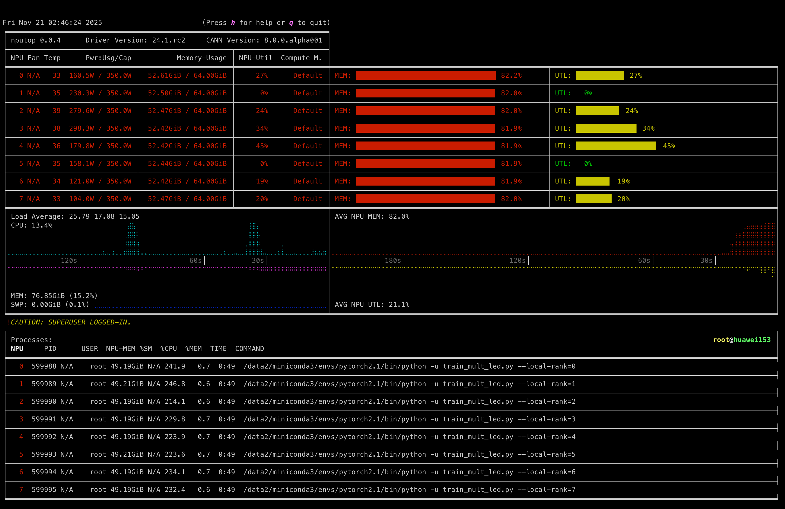
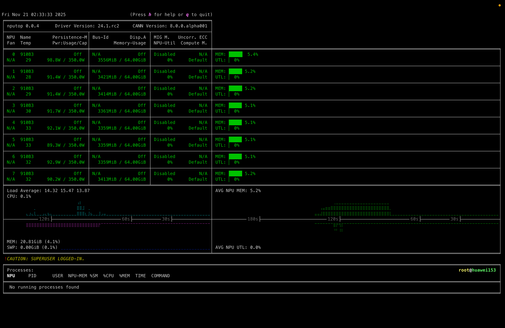

# nputop

[](https://www.python.org/)
[](https://pepy.tech/project/ascend-nputop)
[](https://anaconda.org/conda-forge/nputop)

[](LICENSE)
[](README_zh.md)

---

`nputop` is an **interactive command-line tool** designed specifically for monitoring and managing processes running on **Ascend NPUs**. 

---

## Key Features

* **Real-time monitoring**: Track NPU usage, memory status, temperature, and power draw.
* **System Information**: Display driver and CANN version, and estimate power limits for different NPU models.
* **Interactive UI**: Navigate with keyboard/mouse and manage processes effortlessly.
* **Process management**: View, select, and interact with running NPU processes directly.
* **Multi-NPU Support**: Efficiently manage multiple Ascend NPUs simultaneously.
* **CLI convenience**: Easy integration into terminal workflows with minimal setup.
* **Enhanced Compatibility**: Improved support for various Ascend NPU models including Atlas A3 and devices with single NPUs.

---

## Screenshots





---

## What's New

### Latest Improvements

* **Power Limit Estimation**: Automatically estimates power consumption upper limits based on NPU model characteristics (AI cores count and core frequency)
* **Version Information**: Extracts and displays driver version from `npu-smi info` and CANN version from system files
* **Enhanced Device Compatibility**: Fixed regex patterns to properly support Atlas A3 and single NPU devices like OrangePi Pro with Ascend 310B
* **Robust Parsing**: Refactored parsing logic to handle incomplete field scenarios and improve maintainability

---

## Installation

**Prerequisites:**

* Python ≥ 3.9
* Ascend NPU Firmware & Drivers([link](https://www.hiascend.com/en/hardware/firmware-drivers/community))

If you're using Conda, we recommend installing nputop via conda-forge:
```bash
# Option 1: without changing default config
conda install -c conda-forge nputop

# Option 2 (recommended): set conda-forge as highest-priority channel
conda config --add channels conda-forge
conda config --set channel_priority strict

# Then install
conda install nputop
```
Or, if you prefer to use pip, you can install it directly from PyPI:
```bash
pip install ascend-nputop
```

For development or editable installations:

```bash
git clone https://github.com/youyve/nputop.git
cd nputop
pip install -e .
```

---

## Quick Start

Launch `nputop` directly from your terminal:

```bash
nputop
```

Set environment variables (`ASCEND_RT_VISIBLE_DEVICES`) to restrict visible NPUs.

---

## Usage & Shortcuts

* Navigate screens: <kbd>↑</kbd> <kbd>↓</kbd> or <kbd>TAB</kbd>
* Toggle compact mode: <kbd>C</kbd>
* Kill a process: select a process and press <kbd>K</kbd>
* Refresh manually: <kbd>R</kbd>
* Exit: <kbd>Q</kbd> or <kbd>Ctrl</kbd>+<kbd>C</kbd>

---

## Supported Devices

### Currently Supported
* ✅ **Ascend 910 Series** - Full support
* ✅ **Ascend 310B** - Enhanced compatibility for single NPU configurations
* ✅ **Atlas A3** - Improved device detection and parsing

### Power Estimation
nputop now provides intelligent power limit estimation for NPU models where exact power data is unavailable, based on:
- Number of AI cores
- Core frequency characteristics

---

## Project Structure

```
nputop
├── assets/             # Images for documentation
├── nputop/
│   ├── api/            # Ascend NPU APIs & backend
│   ├── gui/            # Interactive UI (GPL-3.0-only)
│   ├── cli.py          # Command-line entry point
│   └── version.py      # Versioning and metadata
├── tests/              # Unit tests for parsing and compatibility
├── COPYING             # GPL-3.0 License file
├── LICENSE             # Apache 2.0 License file
├── NOTICE              # Acknowledgments and Notices
├── pyproject.toml      # Project configuration
├── setup.py            # Build script
└── README.md           # Documentation
```

---

## Known Issues & Roadmap

### Recently Resolved ✅
* **Power limit data**: Now estimated based on NPU model characteristics
* **Driver/CANN version display**: Extracted from system information
* **Atlas A3 compatibility**: Fixed device detection and parsing
* **Single NPU device support**: Improved for devices like OrangePi Pro with Ascend 310B

### Ongoing Work 🚧
* **Extended NPU model support**: Expanding beyond 910 series
* **Performance optimizations**: For large-scale NPU deployments
* **Additional metrics**: Enhanced monitoring capabilities

---

## Contributing

We warmly welcome contributions! Feel free to:

* Report bugs and request features via [Issues](https://github.com/youyve/nputop/issues).
* Fork the repository and submit pull requests.
* Improve documentation and examples.
* Add support for new NPU models and configurations.

### Testing
We particularly appreciate contributions that include unit tests for new NPU models

---

## License

This project (`nputop`) is derived from the original project [`nvitop`](https://github.com/XuehaiPan/nvitop) by Xuehai Pan.

The licenses applied are:

* **API Modules:** [Apache License 2.0](https://www.apache.org/licenses/LICENSE-2.0)
* **GUI Modules:** [GNU General Public License v3.0 only](https://www.gnu.org/licenses/gpl-3.0.html)

For full details, see [LICENSE](LICENSE), [COPYING](COPYING), and [NOTICE](NOTICE).

---

## Contact

* **Maintainer:** [Lianzhong You](mailto:youlianzhong@gml.ac.cn)

---

Enjoy monitoring your Ascend NPUs with `nputop`! 🎉
