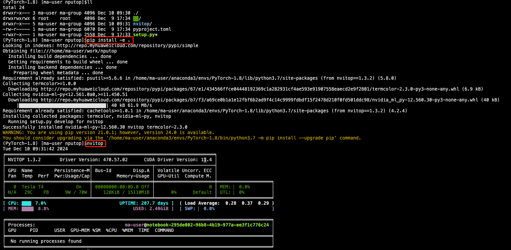

# nputop

An interactive HUAWEI Ascend-NPU process viewer.


## 项目链接

原始项目链接：https://github.com/XuehaiPan/nvitop

开发项目链接：https://github.com/youyve/nputop


## 开发指南

开发项目链接是nvitop功能最核心的代码，也是nvitop能运行的最精简的代码，nputop项目的开发主要基于这个https://github.com/youyve/nputop项目进行开发。

### 安装与测试

```bash
# 下载待开发的项目
git clone https://github.com/youyve/nputop.git
cd nputop
# 切换到dev分支
git checkout dev
# 从项目的源码进行安装测试（目前只能在NVIDIA的GPU上安装）
pip install -e .
# 安装完成后使用nvitop命令即可看到监视器
```



### git协同开发

https://github.com/youyve/nputop该项目目前有main和dev两个分支，日常开发使用dev分支进行开发和提交。

分支切换

```bash
git checkout dev
```

由于项目较小开发人员也不多，若是觉得git搞不明白，直接写也行，写好通过测试在群里直接发出来然后有我这边进行整合

### 开发内容

先详细阅读并理解开发项目的代码，原始项目主要是通过pynvml库来获取NVIDIA GPU的信息，而待开发项目需要将项目中通过pynvml库调用的api替换为pyacl的api。注意pynvml的接口不完全与pyacl的接口相对应，可能需要在迁移过程中进行取舍和组合。

这是pyacl的api参考文档：

https://www.hiascend.com/document/detail/zh/canncommercial/700/inferapplicationdev/aclpythondevg/nottoctopics/aclpythondevg_01_0062.html


### 项目结构

```bash
nputop
├── README.md
├── nvitop
│   ├── __init__.py
│   ├── __main__.py
│   ├── api           # 主要是迁移这个文件夹下的内容
│   ├── cli.py
│   ├── gui
│   ├── select.py
│   └── version.py
├── pyproject.toml
└── setup.py
```

