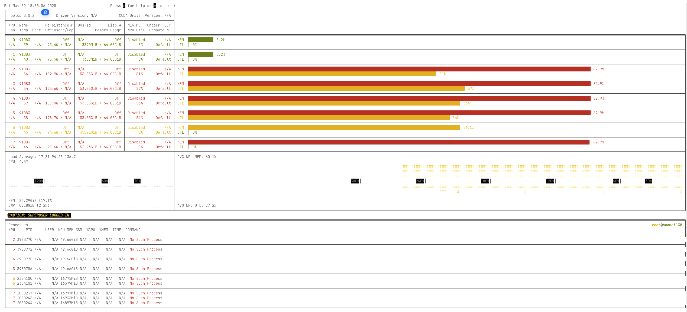
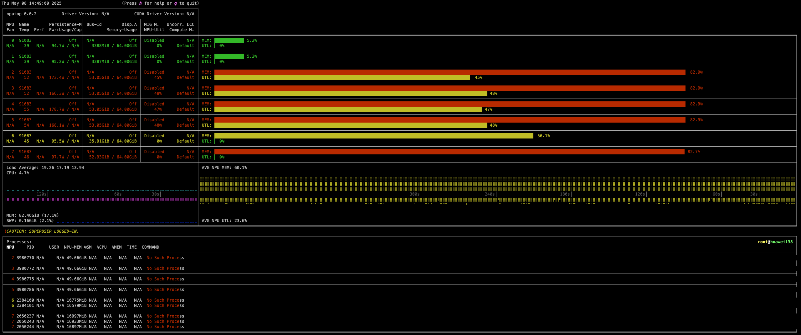

# nputop: Interactive Ascend-NPU Process Viewer 🚀

[](LICENSE)
[](https://www.python.org/)

[](https://github.com/youyve/nputop/stargazers)
[](README_zh.md)

---

`nputop` is an **interactive command-line tool** designed specifically for monitoring and managing processes running on **Ascend NPUs**. Inspired by the popular [nvitop](https://github.com/XuehaiPan/nvitop) project, `nputop` brings a similar, intuitive user experience to the Ascend NPU ecosystem, providing real-time insights into utilization, memory usage, temperature, power consumption, and more.

---

## 🌟 Key Features

* **Real-time monitoring**: Track NPU usage, memory status, temperature, and power draw.
* **Interactive UI**: Navigate with keyboard/mouse and manage processes effortlessly.
* **Process management**: View, select, and interact with running NPU processes directly.
* **Multi-NPU Support**: Efficiently manage multiple Ascend NPUs simultaneously.
* **CLI convenience**: Easy integration into terminal workflows with minimal setup.

---

## 📸 Screenshots






---

## ⚙️ Installation

**Prerequisites:**

* Python ≥ 3.10
* Ascend NPU Drivers and Runtime Environment ([CANN](https://www.hiascend.com/software/cann/commercial))

```bash
pip install ascend-nputop
```

For development or editable installations:

```bash
git clone https://github.com/youyve/nputop.git
cd nputop
pip install -e .
```

---

## 🚀 Quick Start

Launch `nputop` directly from your terminal:

```bash
nputop
```

set environment variables (`ASCEND_RT_VISIBLE_DEVICES`) to restrict visible NPUs.

---

## 🔑 Usage & Shortcuts

* Navigate screens: <kbd>←</kbd> <kbd>→</kbd> or <kbd>TAB</kbd>
* Sort columns: <kbd>S</kbd>
* Toggle compact mode: <kbd>C</kbd>
* Kill a process: select a process and press <kbd>K</kbd>
* Refresh manually: <kbd>R</kbd>
* Exit: <kbd>Q</kbd> or <kbd>Ctrl</kbd>+<kbd>C</kbd>

---

## 🛠️ Project Structure

```
nputop
├── assets/             # Images for documentation
├── nputop/
│   ├── api/            # Ascend NPU APIs & backend
│   ├── gui/            # Interactive UI (GPL-3.0-only)
│   ├── cli.py          # Command-line entry point
│   └── version.py      # Versioning and metadata
├── COPYING             # GPL-3.0 License file
├── LICENSE             # Apache 2.0 License file
├── NOTICE              # Acknowledgments and Notices
├── pyproject.toml      # Project configuration
├── setup.py            # Build script
└── README.md           # Documentation
```

---

## 📋 Known Issues & Roadmap

* 🚧 **Metrics acquisition anomalies** for single NPU displays.
* 🚧 **Incomplete parameter display** for some NPU metrics.
* 🚧 **Real-time process tracking issues**, such as abnormal process name display.

These performance issues and feature gaps are being actively addressed in ongoing development iterations. Contributions are highly encouraged to help us improve `nputop`.

---

## 🤝 Contributing

We warmly welcome contributions! Feel free to:

* Report bugs and request features via [Issues](https://github.com/youyve/nputop/issues).
* Fork the repository and submit pull requests.
* Improve documentation and examples.

---

## 📃 License

This project (`nputop`) is derived from the original project [`nvitop`](https://github.com/XuehaiPan/nvitop) by Xuehai Pan.

The licenses applied are:

* **API Modules:** [Apache License 2.0](https://www.apache.org/licenses/LICENSE-2.0)
* **GUI Modules:** [GNU General Public License v3.0 only](https://www.gnu.org/licenses/gpl-3.0.html)

```
Copyright (c) 2025 Xuehai Pan <XuehaiPan@pku.edu.cn>
Copyright (c) 2025 Lianzhong You <youlianzhong@gml.ac.cn>
```

For full details, see [LICENSE](LICENSE), [COPYING](COPYING), and [NOTICE](NOTICE).

---

## 📧 Contact

* **Maintainer:** [Lianzhong You](mailto:youlianzhong@gml.ac.cn)

---

Enjoy monitoring your Ascend NPUs with `nputop`! 🎉
