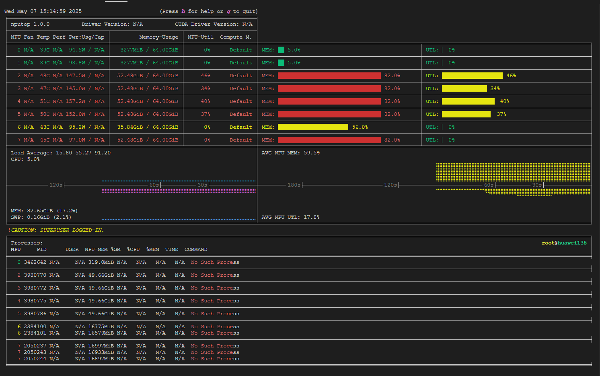

# nputop：交互式 Ascend NPU 进程查看器 🚀

[](LICENSE)
[](https://www.python.org/)

[](https://github.com/youyve/nputop/stargazers)

---

`nputop` 是一个专为监控和管理运行在 **Ascend NPU** 上的进程设计的**交互式命令行工具**。受流行的 [nvitop](https://github.com/XuehaiPan/nvitop) 项目的启发，`nputop` 为 Ascend NPU 生态系统带来了类似的直观用户体验，提供利用率、内存使用情况、温度、功耗等的实时洞察。

---

## 🌟 主要功能

* **实时监控**：跟踪 NPU 使用率、内存状态、温度和功耗。
* **交互式界面**：使用键盘/鼠标导航，轻松管理进程。
* **进程管理**：直接查看、选择和交互运行中的 NPU 进程。
* **多 NPU 支持**：同时高效管理多个 Ascend NPU。
* **命令行便利**：最小化设置，轻松集成到终端工作流中。

---

## 📸 截图



---

## ⚙️ 安装

**前置条件：**

* Python ≥ 3.7
* Ascend NPU 驱动和运行时环境 ([CANN](https://www.hiascend.com/software/cann/commercial))

```bash
pip install nputop
```

对于开发或可编辑安装：

```bash
git clone https://github.com/youyve/nputop.git
cd nputop
pip install -e .
```

---

## 🚀 快速开始

直接从终端启动 `nputop`：

```bash
nputop
```

设置环境变量（`ASCEND_RT_VISIBLE_DEVICES`）以限制可见的 NPU。

---

## 🔑 使用方法与快捷键

* 切换屏幕：<kbd>←</kbd> <kbd>→</kbd> 或 <kbd>TAB</kbd>
* 排序列：<kbd>S</kbd>
* 切换紧凑模式：<kbd>C</kbd>
* 终止进程：选择一个进程并按 <kbd>K</kbd>
* 手动刷新：<kbd>R</kbd>
* 退出：<kbd>Q</kbd> 或 <kbd>Ctrl</kbd>+<kbd>C</kbd>

---

## 🛠️ 项目结构

```
nputop
├── assets/             # 文档用图片
├── nputop/
│   ├── api/            # Ascend NPU API 和后端
│   ├── gui/            # 交互式界面（仅限 GPL-3.0）
│   ├── cli.py          # 命令行入口
│   └── version.py      # 版本和元数据
├── COPYING             # GPL-3.0 许可证文件
├── LICENSE             # Apache 2.0 许可证文件
├── NOTICE              # 致谢和声明
├── pyproject.toml      # 项目配置
├── setup.py            # 构建脚本
└── README.md           # 文档
```

---

## 📋 已知问题与路线图

* 🚧 **启动速度慢**，相比 GPU 解决方案。
* 🚧 **部分 NPU 指标显示不完整**。
* 🚧 **利用率（UTL）刷新率延迟** 和实时进程跟踪问题。

这些性能问题和功能差距正在持续开发中积极解决。热烈欢迎贡献以帮助改进 `nputop`。

---

## 🤝 贡献

我们热烈欢迎贡献！您可以：

* 通过 [Issues](https://github.com/youyve/nputop/issues) 报告错误或请求功能。
* Fork 仓库并提交拉取请求。
* 改进文档和示例。

---

## 📃 许可证

本项目（`nputop`）衍生自原始项目 [`nvitop`](https://github.com/XuehaiPan/nvitop)，作者为薛海攀。

适用的许可证为：

* **API 模块**：[Apache 许可证 2.0](https://www.apache.org/licenses/LICENSE-2.0)
* **GUI 模块**：[GNU 通用公共许可证 v3.0 仅限](https://www.gnu.org/licenses/gpl-3.0.html)

```
版权所有 (c) 2025 XuehaiPan <XuehaiPan@pku.edu.cn>
版权所有 (c) 2025 Lianzhong You <youlianzhong@gml.ac.cn>
```

详情请见 [LICENSE](LICENSE)、[COPYING](COPYING) 和 [NOTICE](NOTICE)。

---

## 📧 联系方式

* **维护者**：[Lianzhong You](mailto:youlianzhong@gml.ac.cn)

---

使用 `nputop` 愉快地监控您的 Ascend NPU！🎉